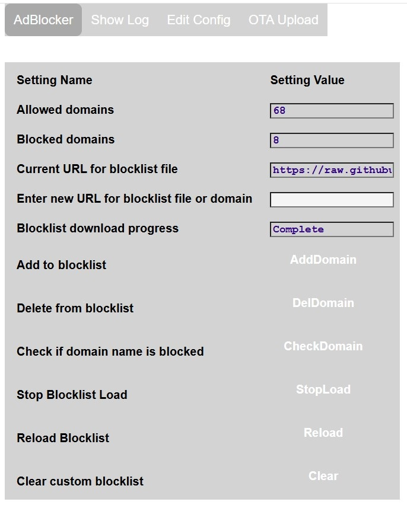

# ESP32_AdBlocker

ESP32_AdBlocker acts as a DNS Sinkhole (like [Pi-Hole](https://pi-hole.net/)) by returning 0.0.0.0 for any domain names in its blocklist, else uses an external DNS server to resolve IP addresses. This prevents content being retrieved from or sent to blocked domains. A web server is provided to control the service and monitor its operation. 

## Requirements

ESP32_AdBlocker is an Arduino sketch. The ESP32 module needs PSRAM: 
* ESP32-S3 with 8MB PSRAM can host a currently sized blocklist. Blocklist checks take <50 micro seconds.
* ESP32 with 4MB PSRAM may truncate a currently sized blocklist. Blocklist checks take <100 micro seconds.

## Operation

After power up, the defaut blocklist will be downloaded. It will take several minutes for ESP32_AdBlocker to be ready after processing and sorting the data. Progress can be monitored on the web page. Subsequent reloads of the same file are much quicker as only updates need to be processed. ESP32-S3 is about twice as fast as the ESP32.
As only one file can be downloaded, a consolidated blocklist should be used. Ideally select a file less than the size of the PSRAM. The file format should be in either HOSTS format or Adblock format (only domain name entries processed). The following site for example provides a list of suitable files: https://github.com/StevenBlack/hosts.

ESP32_AdBlocker will subsequently download the selected file daily at a given time to keep the blocklist updated. The user can also individually add their own sites to block or unblock which are stored in a local custom blocklist.

The entries on the ESP32_AdBlocker web page are:
* **Allowed domains**: number of domain requests which have been allowed through since restart
* **Blocked domains**: number of domain requests which have been blocked since restart
* **Current URL for blocklist file**: URL for blocklist being used
* **Enter new URL for blocklist or domain**:
  * After entering new URL for blocklist, press **Reload** button to download, or leave blank to reload current blocklist.
  * After entering extra domain URL to be blocked, press **AddDomain** button. Not added if a duplicate or not resolvable. Alert message will show result.
  * After entering existing domain URL to be be removed from blocklist, press **DelDomain** button. Alert message will show result.
  * After entering domain URL to check if in blocklist, press **CheckDomain** button. Alert message will show result.
* **Stop Blocklist Load**: Press **StopLoad** button to stop the currently downloading blocklist.
* **Clear custom blocklist**: Clear the custom entries manually added or removed by user

To make ESP32_AdBlocker your preferred DNS server, enter its IPv4 address in place of the current DNS server IPs in your router / devices. ESP32_AdBlocker does not have an IPv6 address but some devices use IPv6 by default, so disable IPv6 DNS on your device / router to force it to use IPv4 DNS.  
Eg for a Windows PC network adapter, to use AdBlocker as DNS Server having IP address `192.168.1.168`, at the Windows command prompt, enter:  
`netsh interface ip set dns "Wi-Fi" static 192.168.1.168`  
To switch back to usual DNS Server, eg Google, enter:  
`netsh interface ip set dns "Wi-Fi" static 8.8.8.8`  

Browsers must have **Use secure DNS** disabled as this overrides adapter and router DNS settings.

## Installation

Download github files into the Arduino IDE sketch folder, removing `-main` from the application folder name.

Compile using esp32 arduino core min v3.1.1 with PSRAM enabled and the following Partition scheme:
* ESP32-S3 - `8M with spiffs (...)`
* ESP32 - `Minimal SPIFFS (...)`

On first installation, the application will start in wifi AP mode - connect to SSID: **ESP32_AdBlocker_...**, to allow router and password details to be entered via the web page on `192.168.4.1`. The configuration data file (except passwords) is automatically created, and the application web pages automatically downloaded from GitHub to the SD card **/data** folder when an internet connection is available.

Subsequent updates to the application, or to the **/data** folder files, can be made using the **OTA Upload** tab. The **/data** folder can also be reloaded from GitHub using the **Reload /data** button on the **Edit Config** tab, or by using a WebDAV client.

## Configuration

More configuration details accessed via **Edit Config** tab, which displays further buttons:

* **Network**:
Additional network and webserver settings. In particular set:
  * Router IP Address to obtain static IP
  * Static IP Address, used as AdBlocker DNS Server IP

* **Settings**: 
Environmental settings affecting blocklist operation.

* **Ethernet**: 
Select the required [Network](#network-selection). To configure Ethernet, define the SPI pin numbers used to connect to the external Ethernet controller.
Press **Save** to make changes persistent.

## Logging

The application log messages can be monitored on the web page tab **Show Log**.

The **Verbose** button will reveal extra logging for each blocked or accepted connection.

## Network Selection

Default network interface is Wifi, but Ethernet could be used instead using boards with built in Ethernet, or by connecting an external Ethernet controller.
Feature only tested for W5500 Ethernet controller connected to ESP32S3 board.
The selected network interface is available after configuration and reboot.

Options:
* **WiFi**: default, also fallback if Ethernet cannot be connected
* **Eth+AP**: Ethernet plus ESP Access Point. Do not open web pages on each network concurrently.
* **Ethernet**: Ethernet only, no Wifi

