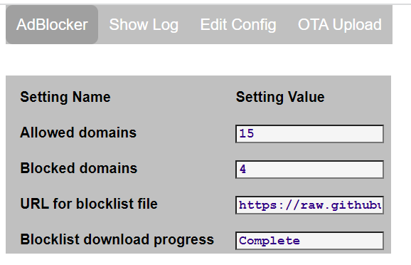

# ESP32_AdBlocker

ESP32_AdBlocker acts as a DNS Sinkhole (like [Pi-Hole](https://pi-hole.net/)) by returning 0.0.0.0 for any domain names in its blocklist, else forwards to an external DNS server to resolve IP addresses. This prevents content being retrieved from or sent to blocked domains. A web server is provided to control the service and monitor its operation. 

## Requirements

ESP32_AdBlocker is an Arduino sketch. The ESP32 module needs PSRAM: 
* ESP32-S3 with 8MB PSRAM can host a currently sized blocklist. Domain searches take <50 micro seconds.
* ESP32 with 4MB PSRAM will truncate a currently sized blocklist. Domain searches take <100 micro seconds.

## Operation

The ESP32_AdBlocker web page is used to enter the URL of the blocklist to be downloaded: 

Press __Reload__ to download the file. It will take a several minutes for ESP32_AdBlocker to be ready after processing and sorting the data. Progress can be monitored on the web page. Subsequent reloads of the same file are much quicker as only updates need to be processed.
As only one file can be downloaded, a consolidated blocklist should be used. Select a file less than the size of the PSRAM. The file format should be in either HOSTS format or Adblock format (only domain name entries processed). The following site for example provides a list of suitable files: https://github.com/StevenBlack/hosts.

ESP32_AdBlocker will subsequently download the selected file daily at a given time to keep the blocklist updated.

To make ESP32_AdBlocker your preferred DNS server, enter its IPv4 address in place of the current DNS server IPs in your router / devices. ESP32_AdBlocker does not have an IPv6 address but some devices use IPv6 by default, so disable IPv6 DNS on your device / router to force it to use IPv4 DNS.

## Installation

Download github files into the Arduino IDE sketch folder, removing `-master` from the application folder name.

Compile with PSRAM enabled and the following Partition scheme:
* ESP32-S3 - `8M with spiffs (...)`
* ESP32 - `Minimal SPIFFS (...)`

On first installation, the application will start in wifi AP mode - connect to SSID: **ESP32_AdBlocker_...**, to allow router and password details to be entered via the web page on 192.168.4.1. The application web pages and configuration data file (except passwords) are stored in the **/data** folder which is automatically downloaded to flash from GitHub. The **/data** folder can also be loaded via OTA.

Subsequent updates to the application, or to the **/data** folder contents, can be made using the **OTA Upload** tab. The **/data** folder can also be reloaded from GitHub using the **Reload /data** button on the **Edit Config** tab.

## Configuration

More configuration details accessed via **Edit Config** tab, which displays further buttons:

**Wifi**:
Additional WiFi and webserver settings.

**Settings**: 
environmental settings affecting blocklist operation

Press **Save** to make changes persistent.

## Logging

The application log messages can be monitored on the web page tab **Show Log**.

